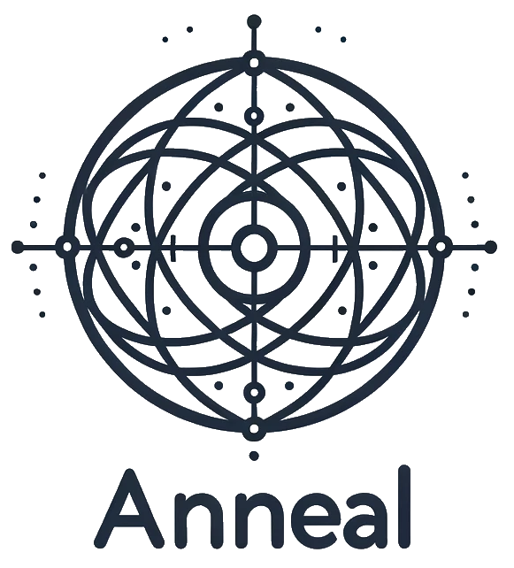

# Anneal [](https://zenodo.org/doi/10.5281/zenodo.10672746)


This is a `python` package for simulated annealing (and quenching) in all its
many guises. The design decisions are described in the corresponding [ArXiV preprint](https://arxiv.org/abs/2302.02811v2).

## Development

`pdm` is used throughout.

``` sh
micromamba create -f environment.yml
micromamba activate anneal-dev
```

## Contributing

> All contributions are welcome!!

- We follow the [NumPy commit guidelines](https://numpy.org/doc/stable/dev/development_workflow.html#writing-the-commit-message).
- Please run `pdm all` and ensure no linting or test errors exist
- [Co-author commits](https://github.blog/2018-01-29-commit-together-with-co-authors/) generously

# License
MIT.
