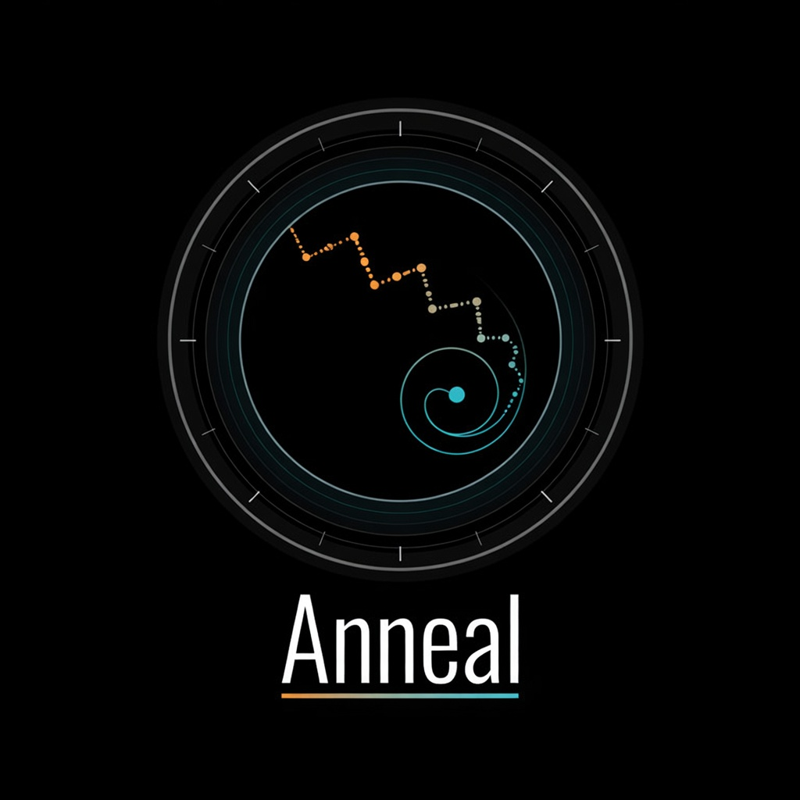

<p align="center">
  
</p>

# Anneal

**Start here.** Bound-constrained global optimization with a single budget knob, or classical simulated-annealing presets you can swap without rewriting a driver.

Simulated-annealing components on the [eindir](https://github.com/HaoZeke/eindir) typed primitives. One surface, many drivers: classical presets, Bayesian pilot+mixer, generalized Langevin equation (GLE) colored noise, rank-1 additive independence, quasi-Monte Carlo (QMC) polish, device/ensemble scale. All obey the same five-component algebra (Obj / Cool / Neigh / Move / Accept) and four composition laws checked at construction.

| | |
|---|---|
| Docs | https://anneal.rgoswami.me |
| License | MIT |
| Software DOI | https://zenodo.org/doi/10.5281/zenodo.10672746 |
| Paper reproducibility | https://github.com/HaoZeke/anneal_repro — Zenodo [10.5281/zenodo.20672621](https://doi.org/10.5281/zenodo.20672621) |
| History | Continuous development since **2023-02** (see git log); multi-author `CITATION.cff` |

## Install

```bash
pip install anneal
```

Full stack (pinned Rust + Python + docs):

```bash
pixi install
```

## Start here (budget-only portfolio)

The intended stand-alone tool for most users: pass an objective, box bounds, and a work-unit budget (objective and gradient evaluations share the counter).

```python
import numpy as np
from anneal import global_optimize

def rastrigin(x):
    return 10.0 * len(x) + np.sum(x * x - 10.0 * np.cos(2.0 * np.pi * x))

low, high = np.full(5, -5.0), np.full(5, 5.0)
out = global_optimize(rastrigin, low, high, budget=4000, seed=0)
print(out["best_val"], out["best_pos"])
```

Runnable copies:

- Script: [`examples/quickstart_portfolio.py`](examples/quickstart_portfolio.py)
- Notebook: [`examples/notebooks/01_quickstart.ipynb`](examples/notebooks/01_quickstart.ipynb)
- Website quickstart + four tutorials: https://anneal.rgoswami.me

## Classical presets (same driver, different slots)

```python
from anneal import Boltzmann, Fast, Gsa, run

h = run(rastrigin, low, high, Boltzmann(t_init=5.0, sigma=0.5),
        n_epochs=40, steps_per_epoch=50, seed=1)
print(h.best_val)
```

## Optional arms (additive independence + QMC polish)

```python
import numpy as np
from anneal import additive_independence, qmc_polish

def rastrigin(x):
    return 10.0 * len(x) + np.sum(x*x - 10.0 * np.cos(2.0 * np.pi * x))

def grad_rastrigin(x):
    return 2.0 * x + 20.0 * np.pi * np.sin(2.0 * np.pi * x)

low = np.full(5, -5.0)
high = np.full(5, 5.0)

# Values-only rank-1 independence (no gradient)
res = additive_independence(rastrigin, low, high, max_fevals=3000, seed=7)

# Polish with gradient
refined = qmc_polish(rastrigin, grad_rastrigin, low, high,
                     n_starts=32, max_fevals_per_start=50, seed=0, top_k=1)
print(refined["best_val"])
```

Full docs, tutorials (classical, Bayesian pilot+mixer, GLE, polish+device), algebra, how-tos, and reference at https://anneal.rgoswami.me .

## Development

```bash
pixi install
pixi run -e python python-test
pixi run -e docs docs-export
pixi run -e docs docs-build
```

See `pixi.toml` and `docs/export.el` (modeled on rgpycrumbs/rsx-rs patterns).

## License and citation

MIT (see `LICENSE.txt`). Citation: `CITATION.cff` or the software Zenodo DOI. Multi-author software citation lists six authors. Project history since February 2023. Reproducibility package for paper tables and figures: [HaoZeke/anneal_repro](https://github.com/HaoZeke/anneal_repro) (Zenodo [10.5281/zenodo.20672621](https://doi.org/10.5281/zenodo.20672621)).
